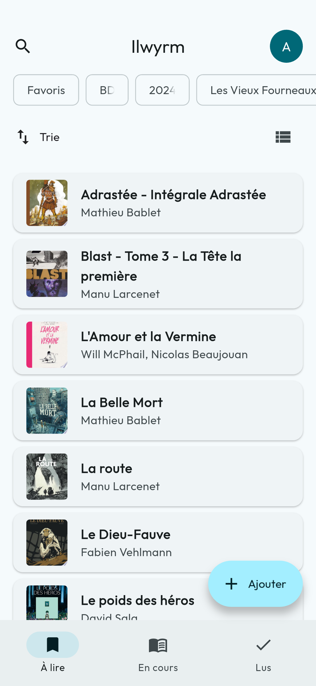
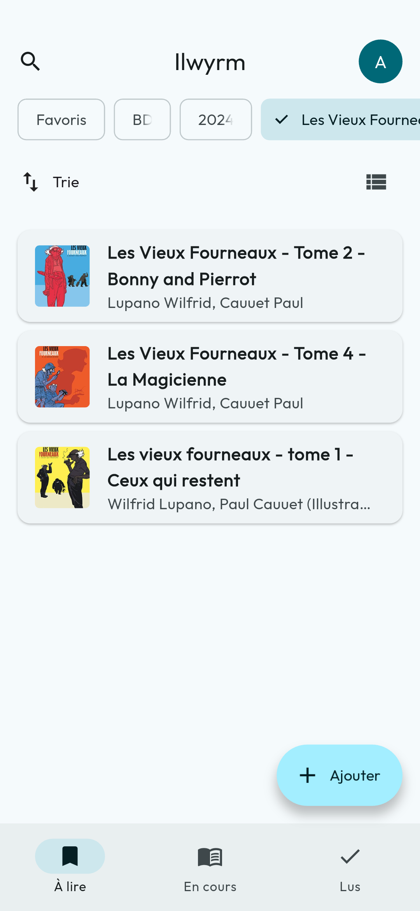
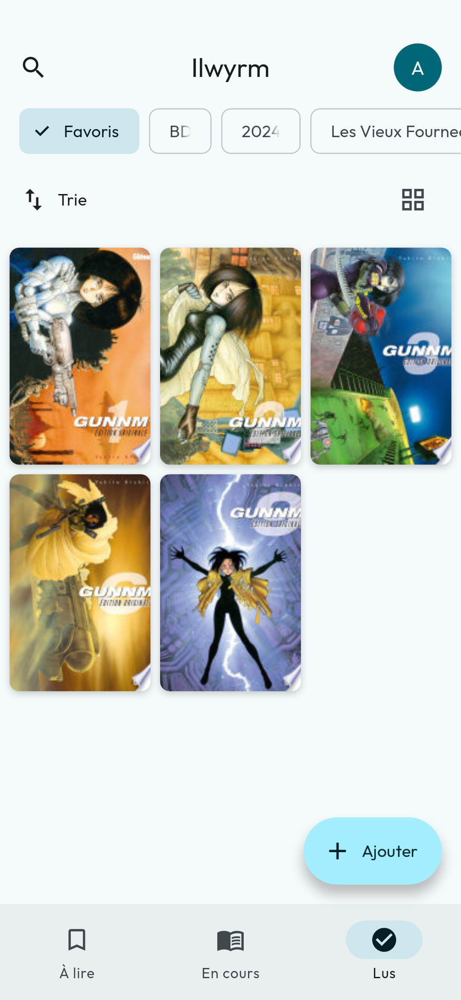
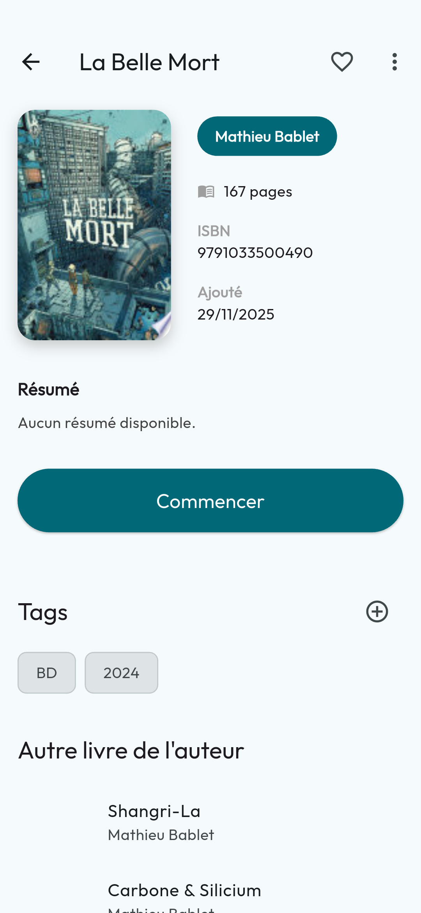
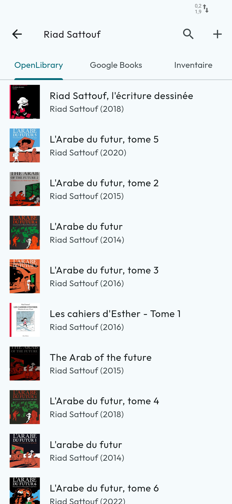

# Ilwyrm

Ilwyrm est une application Flutter pour gérer votre collection de livres. Ilwyrm permet de suivre vos livres, de les ajouter, de les supprimer, de les modifier, de les rechercher et de les trier.

Elle est conçue pour être rapide et réactive, offrant une expérience utilisateur fluide.

L'application tire son nom du service fédéré Bookwyrm et est pensée pour être un front à ce service le jour où une API sera disponible. En attendant, il permet de suivre vos livres et de les ajouter à votre collection en local avec une fonction d'importation et d'exportation via un fichier CSV vers Bookwyrm.

## Captures d’écran

<div style="display: flex; flex-wrap: wrap; gap: 10px;">









</div>


## Fonctionnalités

Les agrégations sont faites via les API suivantes :
- Open Library
- Google Books
- Inventaire.io

L'application est compatible avec Material Design 3 de Google.

Le logo de l'application est inspiré de l'illustration de la couverture de machin.

## Installation

Pour installer les dépendances et lancer l'application :

```bash
flutter pub get
flutter run
```

## Reste à faire

- export file / import file
- ajout d'animations et de transitions
- faire la béta
- ajout de dossier
- ajout du multilangage
- interface pour PC
- ajout d'une page de stat
- ajout d'un about
- ajout du logo
- ajout de la selection multiple dans home
- ajout rapide dans le search
- revoir l'UI des tags
